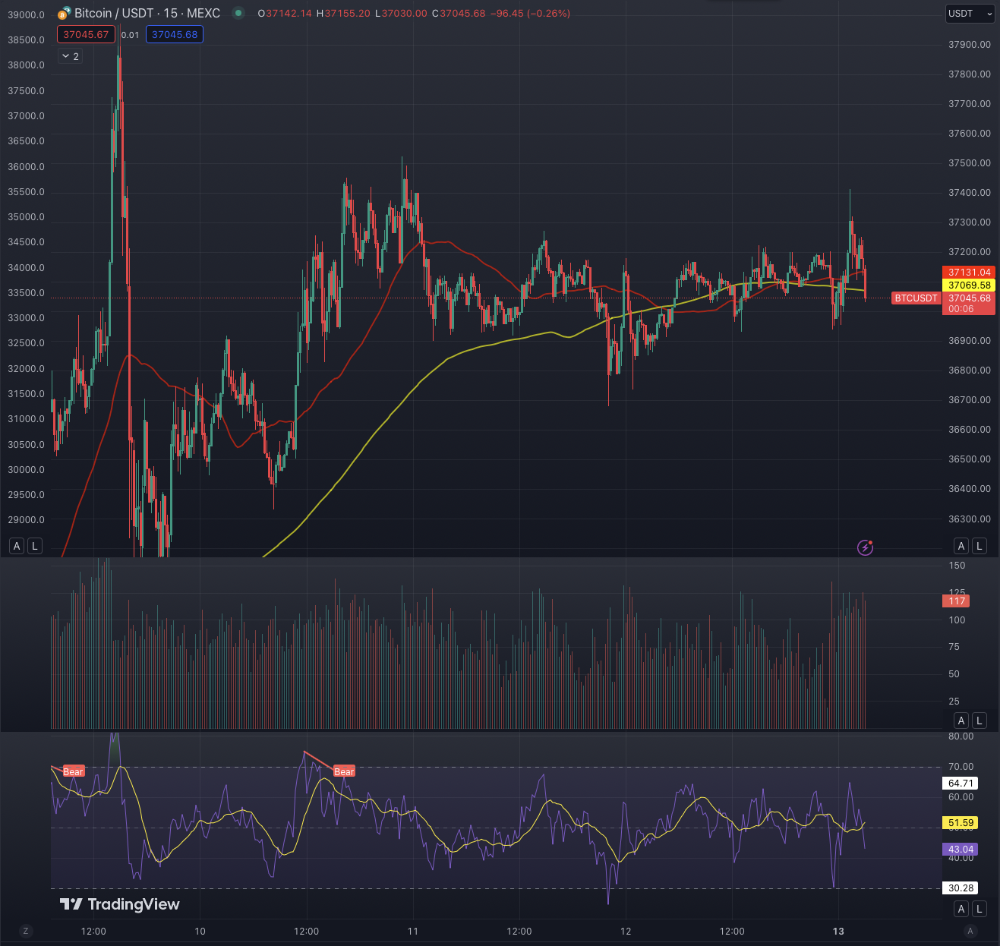

# OpenAI Crypto Trader Assistant

### This script utilizes OpenAI's GPT (Generative Pre-trained Transformer) model for vision to create a crypto trader assistant that performs technical analysis based on provided charts. The assistant interacts through a conversation where you instruct it on analyzing charts and receive responses.
## Installation

Make sure you have Python installed on your machine.

Install required packages by running:

```bash
pip install requests pillow
```
or
```bash
pip install -r requirements.txt
```
Obtain an OpenAI API key. You can sign up for access on the OpenAI website.

Insert your API key into the api_key variable in the script.


## Usage

Run the script using the following command:

```bash
python main.py
```

The script will prompt you for a chart instruction. Provide a concise instruction for the technical analysis.

Capture a screenshot of the chart and copy it to the clipboard.

The script will automatically process the image and send it, along with your instruction, to the OpenAI API.

The assistant will generate a response based on the analysis of the chart and display it.

You can continue the conversation by entering your responses or instructions as prompted by the script.

### Note: If you want to submit another chart during the conversation, type "chart" when prompted for a new message and provide the new chart instruction.


## Chart example

### Providing a clear and concise chart layout is crucial for the assistant to perform effective technical analysis. Below is an example of a chart layout that I use, which the assistant can comprehend:



While you can use any layout, it's essential to ensure that the assistant can interpret it. This requires instructing the assistant on how to read the chart. For instance, if you want the assistant to analyze the chart for a bullish breakout, provide explicit instructions for identifying such a breakout. The assistant won't be able to understand the chart without specific guidance.


### Example Instruction:

`You are a helpful crypto trader assistant. You will be given a chart and asked to perform technical analysis. On image you will have chart with 50 and 200 MA, under chart you will have volume and bellow it RSI. Try to recognize patterns which can tell where price will go. Keep it short, concise and to the point. Short term should I short or long futures or not enter at the moment?`

## Important Notes

Ensure that the Python environment has internet access to communicate with the OpenAI API.
The script is designed for educational purposes and may require adjustments based on OpenAI API updates.

Feel free to customize and extend the script according to your needs.
